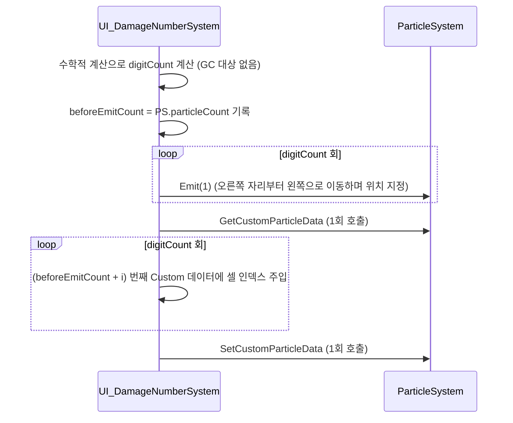

# Design Proposal: CombatVFX Phase B (Damage Numbers) Optimization
**Target**: `Agent/Design/CombatVFX_Optimization_Design.md`
**Audience**: Programmer (Logic Implementation)

---

## 1. Overview

- **목적**: Phase B에서 구현된 `UI_DamageNumberSystem.cs`의 구조적 최적화 및 가비지 컬렉션(GC) 스파이크 방지.
- **최적화 방향**:
  1. `string` 할당 제거 (GC Zero)
  2. `ParticleSystem.Get/SetCustomParticleData` 호출 횟수 최소화 (CPU 부하 감소)
  3. `Camera.main` 프로퍼티 캐싱 (프레임 드랍 방지)
  4. 재활용 버퍼 초기 용량 확보 (Capacity 예약)

---

## 2. Architecture & Optimization Details

### 2.1 GC Allocation 제거 (String 변환 방식 개선)
**As-Is**: `string digits = damage.ToString();`를 사용하여 숫자를 분해. (타격당 GC 발생)
**To-Be**: 수학적 계측(Math.Log10 기반 자릿수 판별)과 `% 10` 모듈로 연산을 사용하여 우측(1의 자리)부터 파티클을 배치. 메모리 할당 없음.

### 2.2 ParticleSystem 커스텀 버퍼 오버헤드 최적화
**As-Is**: 각 자릿수를 `Emit`할 때마다 `for` 루프 내부에서 `GetCustomParticleData`와 `SetCustomParticleData`를 반복 호출. 데이터 크기가 클수록 매우 비효율적.
**To-Be**: 루프 내에서는 `Emit`만 수행하여 여러 개의 파티클을 한 번에 생성한 뒤, 루프 종료 후 **단 1회**만 `Get/SetCustomParticleData`를 호출하여 새로 추가된 인덱스들에 일괄적으로 4x4 셀 인덱스(`Custom1.x`)를 주입.

### 2.3 Camera & Buffer Caching
**As-Is**: 
- 매 방출마다 `Camera.main` 프로퍼티 호출 (내부적으로 캐싱되지만 여전히 함수 스택 발생).
- `_customDataBuffer`의 Capacity가 동적으로 증가하며 내부 배열 재할당 발생 가능.
**To-Be**: 
- `Awake`에서 `_mainCamera = Camera.main;` 캐싱하여 사용.
- `Awake`에서 `_customDataBuffer.Capacity = _particleSystem.main.maxParticles;` 로 미리 예약(Pre-warm).

---

## 3. Data Flow (Optimized `EmitDamageNumber`)

---

## 4. API / Public Interfaces

수정 대상 파일: `UI_DamageNumberSystem.cs` (Public API 변경 없음, 내부 로직만 변경)

| 파일 | 변경 메서드 | 최적화 내용 |
|------|-------------|-------------|
| `UI_DamageNumberSystem.cs` | `Awake()` | `_mainCamera` 캐싱, `_customDataBuffer.Capacity` 예약 |
| `UI_DamageNumberSystem.cs` | `EmitDamageNumber()` | `ToString()` 제거 및 `% 10` 분해 로직 적용 |
| `UI_DamageNumberSystem.cs` | `EmitDamageNumber()` | `ParticleSystem.Emit` / `GetCustomData` 호출 구조 Batching |

---

## 5. Questions / Verification

- 현재 Phase B 구현 후 게임 플레이 시 메모리 프로파일러상 GC Alloc이 0으로 나오는지 확인 필요.
