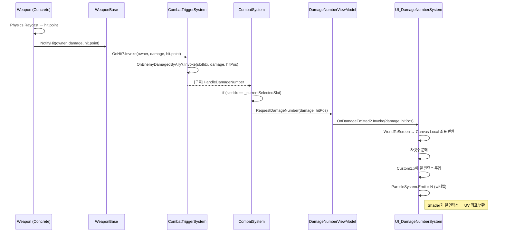

# Design Proposal: CombatVFX Phase B (Damage Numbers) v2
**Target**: `Agent/Design/CombatVFX_PhaseB_Design.md`
**Audience**: Programmer (Logic Implementation)
**작성일**: 2026-03-08

---

## 1. Overview

- **목적**: 전투 씬에서 플레이어가 조작 중인 니케가 적을 공격했을 때, 피해량을 **Canvas(Screen Space) 위에서** 시각적 숫자 파티클로 표시합니다.
- **핵심 변경 (v1 → v2)**:
  - ~~World Space ParticleSystem + ShaderGraph 원근 보정~~ → **Canvas-Space ParticleSystem** 채택.
  - 어느 거리에서든 **일정한 크기**로 보이기 위해 월드 좌표를 스크린 좌표로 변환한 뒤 캔버스 위에 표시합니다.
  - ShaderGraph는 **퇴장 애니메이션용**으로만 사용합니다 (원근 보정 불필요).
  - **4×4 Number Texture** 적용 (사용자 보유 텍스처).

### 1.1 Canvas 위 데미지 파티클 표시 — 기술적 타당성

> [!NOTE]
> **이론상 가능한가?** — ✅ 완전히 가능합니다.

- `Camera.main.WorldToScreenPoint(hitWorldPos)` → `RectTransformUtility.ScreenPointToLocalPointInRectangle()` 변환 체인으로 월드 좌표를 Canvas 로컬 좌표로 정확히 변환할 수 있습니다.
- 기존 `UI_CrosshairBase.cs`에서 이미 동일한 패턴을 사용 중이며, `UI_HealthBarBoard.cs`에서도 월드→스크린 추적을 매 프레임 수행합니다.
- ParticleSystem을 Canvas 하위에 배치하면, `Emit` 시 `position`에 Canvas 로컬 좌표를 넣는 것으로 정확한 위치에 표시됩니다.
- **Perspective UI 카메라 사용 시** Z축을 0으로 강제하여 원근 왜곡(Parallax)을 방지합니다 (기존 코드에서 이미 처리 중).

### 1.2 대안 검토

| 방식 | 장점 | 단점 |
|------|------|------|
| **✅ Canvas ParticleSystem (채택)** | 거리 무관 일정 크기, 1 Draw Call, 파티클 내장 애니메이션 활용 | UV 주입을 위한 Custom Vertex Stream 설정 필요 |
| World Space 파티클 + ShaderGraph 원근 보정 | 별도 좌표 변환 불필요 | ShaderGraph 복잡도 높음, 매 프레임 vertex 계산 비용 |
| UGUI Pool (Text/Image 오브젝트) | 가장 단순한 구현 | Draw Call 비용, 오브젝트 풀링 관리 부담 |
| TextMeshPro Float Text | 완성도 높은 기존 에셋 | TMP 의존, 커스텀 연출 제한 |

---

## 2. 4×4 Number Texture Atlas

### 2.1 텍스처 레이아웃

사용자가 보유한 4×4 텍스처 (16칸)에 숫자가 다음과 같이 배치됩니다:

```
Row 0: [1] [2] [3] [4]
Row 1: [5] [6] [7] [8]
Row 2: [9] [0] [ ] [ ]
```

- **인덱스 매핑**: 숫자 `N`에 대해 텍스처 내 셀 인덱스:
  - `0` → 셀 9 (Row 2, Col 1)
  - `1` → 셀 0 (Row 0, Col 0)
  - `2` → 셀 1 (Row 0, Col 1)
  - ...
  - `9` → 셀 8 (Row 2, Col 0)

### 2.2 UV 계산 (균일 그리드)

4×4 균일 그리드이므로 각 셀의 UV는 프로그래밍적으로 계산 가능합니다:

```
cellU = 1.0 / 4 = 0.25
cellV = 1.0 / 4 = 0.25

셀(col, row):
  uMin = col * 0.25
  uMax = (col + 1) * 0.25
  vMin = 1.0 - (row + 1) * 0.25   (텍스처 Y축 반전)
  vMax = 1.0 - row * 0.25
```

- **가변 폭 처리 불필요**: 4×4 균일 그리드이므로, 기존 설계의 가변 폭 UV Rect 배열이 필요 없습니다. 인덱스로 바로 UV를 계산합니다.
- `Custom1.xy` 에 `(col, row)` 또는 `(cellIndex, _unused)` 를 주입하면 Shader에서 UV를 산출할 수 있습니다.

---

## 3. Architecture

### 3.1 레이어링 구조

```
CombatSystem (Model/Orchestrator)
  └─ HandleDamageNumber() → _damageNumberVM.RequestDamageNumber(damage, hitPos)
      └─ DamageNumberViewModel (ViewModel)
          └─ OnDamageEmitted?.Invoke(damage, hitPos)
              └─ UI_DamageNumberSystem (View, Canvas 하위)
                  └─ EmitDamageNumber() → ParticleSystem.Emit per digit
```

### 3.2 기존 코드 상태 (As-Is)

| 항목 | 상태 | 비고 |
|------|------|------|
| `WeaponBase.OnHit` | ✅ `Vector3 hitPos` 포함 완료 | |
| `CombatTriggerSystem.OnEnemyDamagedByAlly` | ✅ `Vector3 hitPos` 포함 완료 | |
| `CombatTriggerSystem.HandleAllyHit` | ✅ `Vector3 hitPos` 전파 완료 | |
| 각 무기 클래스 `NotifyHit` 호출 | ✅ `hit.point` 전달 완료 | |
| `CombatSystem.HandleDamageNumber()` | ✅ 존재 | 슬롯 필터링 + `RequestEmit` 호출 |
| `CombatSystem._damageNumberSystem` | ⚠️ `DamageNumberSystem` 타입으로 선언 — **해당 클래스 미존재** | 타입 불일치 해소 필요 |
| `DamageNumberViewModel.cs` | ✅ 존재 | `RequestDamageNumber(long, Vector3)` → `OnDamageEmitted` |
| `UI_DamageNumberSystem.cs` | ✅ 존재 (초기 구현) | 단일 Quad Emit, CustomData로 데미지 수치 전달 (글자별 분해 미구현) |

### 3.3 변경 필요 항목 (수정 대상)

#### 3.3.1 `CombatSystem.cs` — 타입 브릿지 변경

> [!IMPORTANT]
> `CombatSystem`에서 `[SerializeField] private DamageNumberSystem _damageNumberSystem` 로 선언되어 있으나, `DamageNumberSystem` 타입이 존재하지 않습니다.
> MVVM 패턴에 맞게 `CombatSystem`은 **ViewModel만 들고** View에게 간접적으로 요청하도록 수정합니다.

- `_damageNumberSystem` 필드 및 관련 `FindFirstObjectByType` 제거.
- 대신 `DamageNumberViewModel _damageNumberVM` 을 생성하고, `HandleDamageNumber()`에서 `_damageNumberVM.RequestDamageNumber(damage, hitPos)` 호출.
- `InitializeHUDAsync()`에서 `UI_DamageNumberSystem`을 `Managers.UI.ShowAsync<UI_DamageNumberSystem>(_damageNumberVM)` 으로 생성.

#### 3.3.2 `UI_DamageNumberSystem.cs` — 글자별 파티클 방출 리팩토링

**현재**: 데미지 1개당 Quad 1개를 Emit하고 CustomData에 데미지 수치를 통째로 전달.
**변경**: 데미지를 **자릿수별로 분해**하여 각 숫자를 개별 파티클로 Emit. 4×4 Atlas 셀 인덱스를 CustomData로 주입.

핵심 변경 사항:
1. `EmitDamageNumber(long damage, Vector3 worldPos)` 내부에서 자릿수 분해 로직 추가.
2. 각 자릿수 파티클의 `Custom1.x`에 **4×4 셀 인덱스** (0~15) 전달.
3. 자릿수별 X 오프셋 계산으로 숫자 가로 배치.

#### 3.3.3 Shader (신규)

- 4×4 Atlas UV Remap 전용 **Unlit Shader** (또는 ShaderGraph).
- `Custom1.x` → 셀 인덱스 → UV 좌표 변환.
- Alpha 제어: `Vertex Color Alpha`로 페이드아웃.
- **원근 보정 불필요** (Canvas 공간이므로).

---

## 4. Sub-Phase 분리

> [!IMPORTANT]
> Phase B는 규모가 크므로 아래 3개 Sub-Phase로 나누어 각 단계를 테스트한 후에 다음으로 진행합니다.

### Sub-Phase B-1: MVVM 파이프라인 연결 + 단일 파티클 테스트
**목표**: CombatSystem → ViewModel → UI_DamageNumberSystem 파이프라인이 정상 동작하는지 확인.

| 항목 | 내용 |
|------|------|
| `CombatSystem.cs` | `DamageNumberSystem` 참조 제거 → `DamageNumberViewModel` 생성 및 주입 |
| `CombatSystem.cs` | `HandleDamageNumber()`에서 `_damageNumberVM.RequestDamageNumber()` 호출 |
| `CombatSystem.cs` | `InitializeHUDAsync()`에서 `Managers.UI.ShowAsync<UI_DamageNumberSystem>(_damageNumberVM)` 생성 |
| `UI_DamageNumberSystem.cs` | 기존 단일 Quad Emit 로직 유지 (글자별 분해 없이 테스트용) |
| **테스트** | 적 공격 시 Canvas에 파티클이 올바른 위치에 나타나는지 확인 |

---

### Sub-Phase B-2: 글자별 파티클 분해 + 4×4 Atlas Shader
**목표**: 데미지 숫자를 자릿수별로 분해하여 개별 파티클로 Emit, 4×4 아틀라스에서 올바른 숫자를 표시.

| 항목 | 내용 |
|------|------|
| `UI_DamageNumberSystem.cs` | `EmitDamageNumber()` 내 자릿수 분해 로직 구현 |
| `UI_DamageNumberSystem.cs` | 각 자릿수의 4×4 셀 인덱스를 `Custom1.x`에 주입 |
| `UI_DamageNumberSystem.cs` | 자릿수별 X 오프셋 계산 (균일 폭) |
| Shader | 4×4 Atlas UV Remap Shader 생성 (ShaderGraph 또는 코드 Shader) |
| ParticleSystem | Color over Lifetime, Size over Lifetime, Velocity 파라미터 세팅 |
| Shader | Alpha 페이드 연출 (Vertex Color Alpha) |
| **테스트** | 데미지 숫자가 올바른 글자별로 표시되는지, 가로 배치가 정상인지 확인 |

---

## 5. Data Flow (v2)



---

## 6. API / Public Interfaces

### Sub-Phase B-1 (변경)

| 대상 파일 | 추가/변경 내용 | Caller (호출자) |
|-----------|---------------|-----------------|
| `CombatSystem.cs` | `DamageNumberViewModel _damageNumberVM` 필드 추가 | 내부 |
| `CombatSystem.cs` | `_damageNumberSystem` (SerializeField) 제거 | — |
| `CombatSystem.cs` | `HandleDamageNumber()` → `_damageNumberVM.RequestDamageNumber()` 호출로 변경 | `CombatTriggerSystem.OnEnemyDamagedByAlly` |
| `CombatSystem.cs` | `InitializeHUDAsync()` 내 `UI_DamageNumberSystem` 생성 추가 | 내부 |

### Sub-Phase B-2 (변경)

| 대상 파일 | 추가/변경 내용 | Caller (호출자) |
|-----------|---------------|-----------------|
| `UI_DamageNumberSystem.cs` | `EmitDamageNumber()` 내부 자릿수 분해 + 셀 인덱스 주입 | `DamageNumberViewModel.OnDamageEmitted` |
| `UI_DamageNumberSystem.cs` | `_digitIndexMap[10]` 인덱스 매핑 테이블 추가 | 내부 |
| Shader (NEW) | `DamageNumberDigit.shadergraph` (4×4 UV Remap) | ParticleSystem Renderer |

---

## 7. 상세 설계: `UI_DamageNumberSystem.EmitDamageNumber()` (B-2)

```csharp
// 숫자 → 4×4 셀 인덱스 매핑
// 텍스처 배치: [1][2][3][4] / [5][6][7][8] / [9][0][ ][ ]
private static readonly int[] DigitToCellIndex = { 9, 0, 1, 2, 3, 4, 5, 6, 7, 8 };

private void EmitDamageNumber(long damage, Vector3 worldPos)
{
    // 1. World → Screen → Canvas Local
    Vector2 screenPos = Camera.main.WorldToScreenPoint(worldPos);
    if (!RectTransformUtility.ScreenPointToLocalPointInRectangle(
            _parentRect, screenPos, _uiCamera, out Vector2 localPos))
        return;

    Vector3 basePos = new Vector3(localPos.x, localPos.y, 0f);

    // 2. 자릿수 분해
    string digits = damage.ToString();
    int digitCount = digits.Length;
    float totalWidth = digitCount * _digitSpacing;
    float startX = basePos.x - totalWidth * 0.5f + _digitSpacing * 0.5f;

    // 3. 글자별 Emit
    for (int i = 0; i < digitCount; i++)
    {
        int digit = digits[i] - '0';
        int cellIndex = DigitToCellIndex[digit];

        var emitParams = new ParticleSystem.EmitParams();
        emitParams.position = new Vector3(startX + i * _digitSpacing, basePos.y, 0f);
        emitParams.startSize = _baseSize;
        emitParams.applyShapeToPosition = false;

        int startIdx = _particleSystem.particleCount;
        _particleSystem.Emit(emitParams, 1);

        // CustomData에 셀 인덱스 전달
        _particleSystem.GetCustomParticleData(_customDataBuffer, ParticleSystemCustomData.Custom1);
        while (_customDataBuffer.Count < _particleSystem.particleCount)
            _customDataBuffer.Add(Vector4.zero);

        if (startIdx < _customDataBuffer.Count)
        {
            // x: 셀 인덱스 (0~15), Shader에서 col = index % 4, row = index / 4
            _customDataBuffer[startIdx] = new Vector4(cellIndex, 0, 0, 0);
        }
        _particleSystem.SetCustomParticleData(_customDataBuffer, ParticleSystemCustomData.Custom1);
    }
}
```

---

## 8. Shader 설계: 4×4 Atlas UV Remap (B-2)

### ShaderGraph 노드 구성

```
[Custom1.x] (셀 인덱스, float)
  → Floor → integer index
  → col = index % 4   (Modulo)
  → row = index / 4   (Floor Division)
  → uMin = col * 0.25
  → vMin = 1.0 - (row + 1) * 0.25

[UV0] (Quad UV)
  → u' = uMin + UV0.x * 0.25
  → v' = vMin + UV0.y * 0.25
  → Sample Texture 2D (_MainTex, (u', v'))
  → Base Color + Alpha

[Vertex Color Alpha]
  → Multiply with texture Alpha
  → Final Alpha 출력
```

- **Surface Type**: Transparent
- **Blending Mode**: Alpha
- **Render Face**: Both

---

## 10. 코드 적용 규칙 (원칙)

1. **데미지 즉시 방출**: `DamageNumberViewModel.OnDamageEmitted` 발생 시 즉시 `EmitDamageNumber`를 통해 파티클 방출.
2. **월드 좌표 릴레이**: 이미 완료 (v1에서 모든 무기 클래스의 `NotifyHit`이 `hit.point` 전달 중).
3. **균일 폭 처리**: 4×4 균일 그리드이므로 자릿수별 X 오프셋은 고정 `_digitSpacing` 값 적용.
4. **원근 보정 불필요**: Canvas 공간에서 렌더링하므로 거리에 따른 크기 변화 없음.
5. **MVVM 패턴 준수**: `CombatSystem`은 View(`UI_DamageNumberSystem`)를 직접 알지 않고, `DamageNumberViewModel`을 통해 간접 통신.

---

## 11. Questions / Decisions

없음 (모든 미정 항목이 v2에서 확정됨).
